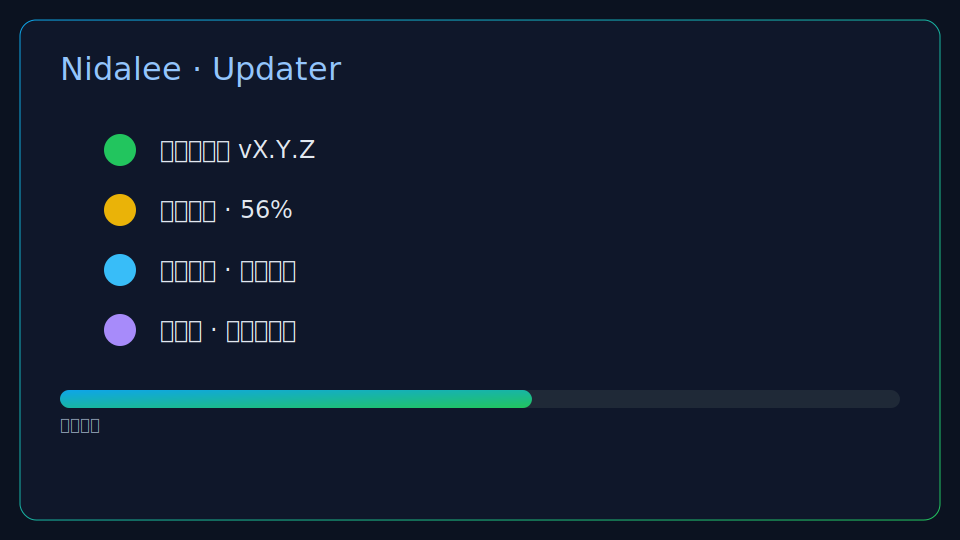
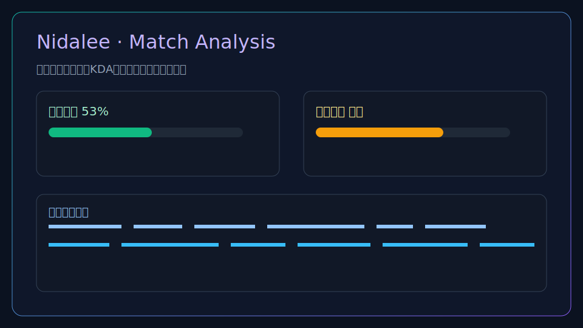

# 🎮 Nidalee


高性能、体积小巧的智能英雄联盟游戏助手。

Nidalee 是一款专为英雄联盟玩家设计的智能助手，集自动接受匹配、自动选/禁英雄、实时数据分析与个性化设置于一体，助你高效上分，安全合规无外挂风险。基于 Rust + Tauri，启动快、资源占用低，体积小巧。

[](https://creativecommons.org/licenses/by-nc-sa/4.0/legalcode.zh-Hans)


- [🎮 Nidalee](#-nidalee)
  - [✨ 特性](#-特性)
  - [⚡ 快速预览](#快速预览)
  - [💡 为什么选择 Nidalee](#-为什么选择-nidalee)
  - [🧭 系统概览](#系统概览)
    - [下载安装](#-下载安装)
    - [安装说明（Windows）](#安装说明windows)
  - [🚀 开发](#-开发)
    - [环境要求](#环境要求)
    - [本地开发](#本地开发)
    - [项目结构](#项目结构)
  - [📋 功能清单](#-功能清单)
  - [📖 使用指南](#-使用指南)
  - [🤝 贡献](#-贡献)
    - [如何参与贡献](#如何参与贡献)
    - [分支命名规范](#分支命名规范)
    - [提交信息规范（Conventional Commits）](#提交信息规范conventional-commits)
    - [发布流程](#发布流程)
  - [🌐 网络与下载说明](#-网络与下载说明)
  - [🛠️ 故障排查](#️-故障排查)
  - [📄 许可证](#-许可证)
  - [⚠️ 免责声明](#️-免责声明)

简体中文 | [English](./README.md)

---

## ✨ 特性

- 🤖 自动化功能：自动接受匹配、自动选择/禁用英雄
- 📊 数据分析：实时游戏数据分析和统计
- 🎯 个性化设置：可自定义的游戏助手配置、生涯背景配置等
- 🔒 安全可靠：直接与 League Client API 交互，无需第三方工具

## 快速预览





## 💡 为什么选择 Nidalee

- 面向 LoL 玩家核心流程：接受匹配、选/禁、对局洞察，一站式、轻量、上手快。
- Rust + Tauri 带来极快启动与低资源占用，长期驻留更友好。
- 采用 shadcn-vue + Tailwind v4 的现代化 UI，深/浅色一致且易扩展。
- 明确的分发与签名策略，仅信任官方发布，供应链安全可信。

## 系统概览

- 轻量与性能：启动快、占用低，适合长期驻留，不打扰。
- 自动更新：启动静默检查，侧边栏一键更新，失败时提供“前往手动下载”兜底。
- 安全分发：仅信任官方发布；安装包附带签名（.sig），更新前校验来源与完整性。
- 现代 UI 与主题：一致的深浅色与 OKLCH 色彩；界面简洁、可读性强。
- 稳定与扩展：组合式与模块化设计，便于后续功能扩展。
- 维护者文档：自动更新与签名配置见 [docs/updates.md](docs/updates.md) 与 [docs/tauri-signing.md](docs/tauri-signing.md)。

## 📦 下载安装

前往 [Releases](https://github.com/codeXcn/Nidalee/releases) 页面下载最新 Windows 版本：

| 平台 | 下载文件 | 说明 |
|------|----------|------|
| Windows | `Nidalee_1.0.0_x64_en-US.msi` | Windows 64 位安装程序 |

### 安装说明（Windows）

1. 下载 `.msi` 文件
2. 双击运行安装程序
3. 安装完成后启动应用，应用会自动检查更新（可在侧边栏看到更新提示与进度）

> 重要：建议以管理员身份运行（右键 → 以管理员身份运行），以确保自动更新、日志写入、网络端口监听等功能权限充足。
> 系统支持：Windows 10/11（x64）。其他平台后续视情况补充。

## 🚀 开发

### 环境要求

- Node.js 20+
- pnpm 10+
- Rust 1.70+
- Tauri CLI 2.0+

### 本地开发

```bash
git clone https://github.com/codeXcn/Nidalee.git
cd Nidalee

# 安装依赖
pnpm install

# 开发模式（Tauri）
pnpm tauri dev

# 构建生产版本（Tauri）
pnpm tauri build
```

### 项目结构

```text
Nidalee/
├── src/                    # Vue.js 前端代码
├── src-tauri/              # Tauri Rust 后端代码
├── .github/workflows/      # GitHub Actions CI/CD
├── dist/                   # 构建输出
└── docs/                   # 项目文档
```

## 📋 功能清单

- [x] 基础架构搭建
- [x] League Client API 集成
- [x] CI/CD 自动化发布
- [x] 用户信息获取和展示
- [x] 召唤师特征分析
- [x] 自动接受匹配功能
- [x] 自动选择/禁用英雄
- [x] 游戏数据分析
- [x] 个性化设置界面
- [ ] 多语言支持

## 📖 使用指南

详见 [使用指南](docs/user-guide-zh.md)

## 🤝 贡献

欢迎提交 Pull Request 或 Issue！

### 如何参与贡献

1. Fork 本仓库并 clone 到本地：`git clone https://github.com/<yourname>/Nidalee.git`
2. 新建分支进行开发（见下方分支命名规范）
3. 开发前安装依赖并启动：`pnpm install && pnpm exec tauri dev`
4. 提交前请本地自检：
   - 代码风格与类型检查：`pnpm lint && pnpm type-check`
   - 可选：尝试打包验证：`pnpm exec tauri build`
5. 提交 PR，附上变更说明、截图/GIF（涉及 UI）、以及关联的 Issue 编号

### 分支命名规范

- 功能：`feature/<scope>-<short-desc>` 例如：`feature/updater-ui`
- 修复：`fix/<scope>-<short-desc>` 例如：`fix/lcu-auth-retry`
- 文档：`docs/<short-desc>` 例如：`docs/update-readme`
- 重构：`refactor/<scope>-<short-desc>` 例如：`refactor/store-modules`
- 性能：`perf/<scope>-<short-desc>` 例如：`perf/table-render`
- 测试：`test/<scope>-<short-desc>` 例如：`test/utils-date`
- 杂项：`chore/<short-desc>` 例如：`chore/ci-cache`

请使用小写、短横线分隔，`<scope>` 建议对应子模块或目录名（如 updater、lcu、store、ui 等）。

### 提交信息规范（Conventional Commits）

基本格式：`type(scope): subject`

常用 type：

- feat：新功能
- fix：缺陷修复
- docs：文档变更
- refactor：重构（无功能行为变化）
- perf：性能优化
- test：测试相关
- chore：构建/脚手架/依赖等杂项
- ci/build：CI 与构建脚本相关

示例：

- `feat(updater): add sidebar manual update entry with progress`
- `fix(lcu): retry on 401 and refresh auth token`
- `docs(readme): add distribution & signature policy`
- `refactor(store): split ui store into modules`

Subject 建议不超过 50 字符，使用祈使句，必要时补充正文说明（空一行后书写）。

### 发布流程

详见 [发布指南](RELEASE.md)

简要步骤：

1. 更新版本号
2. 创建 git tag: `git tag v1.0.1`
3. 推送 tag: `git push origin v1.0.1`
4. GitHub Actions 自动构建并发布

## 🌐 网络与下载说明

- 默认从 GitHub Releases 下载，可能受网络环境影响较慢或失败。
- 若遇到下载缓慢或失败，应用会提供「前往手动下载」按钮，跳转官方 Releases 最新页进行下载安装。
- 后续将视情况提供额外的国内镜像渠道（如提供，会在此处与应用内提示中同步说明）。

## 🛠️ 故障排查

- 更新失败 / 进度长时间卡住：点击提示中的「前往手动下载」，在浏览器打开官方 Releases 页面获取最新安装包。
- Windows SmartScreen 提示：可点击“更多信息”→“仍要运行”，或右键文件→属性→取消阻止，再重试。
- 无法连接 LCU：请确保已登录英雄联盟客户端，必要时重启客户端并重试(确保以管理员身份运行)。
- 权限不足 / 更新失败 / 无法写入：请以管理员身份运行应用（右键 → 以管理员身份运行）；若更新仍失败，请以管理员模式重试或前往 Releases 手动安装；确保安装目录对当前用户可写。

## 📄 许可证

本项目采用 [CC BY-NC-SA 4.0](https://creativecommons.org/licenses/by-nc-sa/4.0/legalcode.zh-Hans)（署名-非商业性使用-相同方式共享）国际许可协议。

- 允许自由复制、分发、演绎，但禁止任何商业用途。
- 衍生作品必须采用相同协议。
- 使用时请注明原作者及项目地址。

完整条款详见 LICENSE 文件。

## ⚠️ 免责声明

本项目仅作为英雄联盟玩家的辅助工具，所有功能均基于 Riot Games 官方公开的 League Client API（LCU API）和客户端本地数据实现。

本工具不进行任何游戏内存、进程、网络数据的篡改，不注入、不修改、不破解游戏客户端，也不具备任何外挂、作弊、加速、脚本等功能。

- 本项目严格遵守英雄联盟用户协议及相关法律法规，仅供学习、研究和个人娱乐用途。
- 所有数据交互均通过官方 API 完成，未对游戏客户端、服务器或数据包进行任何非官方操作。
- 本工具不会收集、上传或泄露用户的任何隐私信息、账号密码等敏感数据。
- 本项目与 Riot Games 及腾讯公司无任何直接或间接关联，亦未获得其官方授权。
- 使用本工具所产生的任何后果（包括但不限于账号风险、数据丢失、功能异常等），开发者不承担任何法律责任和经济责任。
- 本项目及其所有衍生作品严禁任何商业用途，所有贡献和再分发须采用相同协议。

---

Built with ❤️ using [Tauri 2.0](https://tauri.app/) + [Vue.js](https://vuejs.org/)
