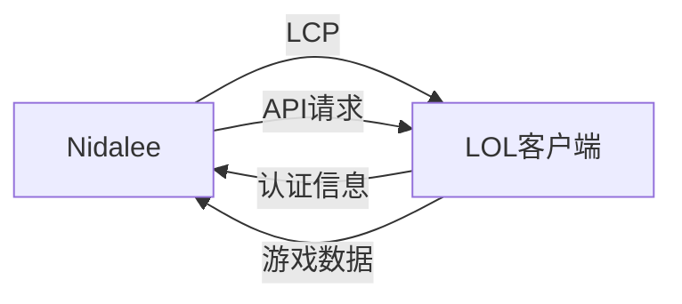

# Nidalee 使用指南

## 目录

- [工作原理](#工作原理)
- [使用步骤](#使用步骤)
- [实时功能](#实时功能)
- [数据流程](#数据流程)
- [注意事项](#注意事项)
- [开发者功能](#开发者功能)
- [常见问题](#常见问题)

## 工作原理

Nidalee 通过 LCP (League Client Protocol) 与英雄联盟客户端进行通信，实现自动化操作和数据分析。

### 基础架构



### 核心组件

1. **前端界面**
   - Vue 3 + TypeScript 实现
   - 实时数据展示
   - 用户交互控制

2. **Rust 后端**
   - 数据分析处理
   - 游戏客户端通信
   - 自动化操作控制

3. **数据流转**
   - 客户端数据采集
   - 实时分析处理
   - 结果反馈展示

## 使用步骤

### 1. 基础设置

1. 启动英雄联盟客户端
2. 运行 Nidalee 助手
3. 等待自动获取认证信息

### 2. 功能配置

#### 2.1 自动接受对局

```typescript
// 配置示例
{
  autoAccept: true,    // 开启自动接受
  acceptDelay: 0       // 延迟时间（秒）
}
```

#### 2.2 英雄选择设置

```typescript
{
  // 自动选择英雄
  autoPickChampion: {
    enabled: true,
    championId: 76,    // 尼德丽
    backupChampions: [  // 备选英雄
      { id: 103, name: "阿狸" },
      { id: 84, name: "阿卡丽" }
    ]
  },
  
  // 自动禁用英雄
  autoBanChampion: {
    enabled: true,
    championId: 157    // 亚索
  }
}
```

#### 2.3 符文配置

```typescript
{
  autoRune: {
    enabled: true,
    source: 'op.gg',              // 数据来源
    updateTiming: 'onChampSelect' // 更新时机
  }
}
```

## 实时功能

### 1. 对局分析

当进入英雄选择时，助手会自动进行以下分析：

#### 1.1 阵容评估
```json
{
  "teamAnalysis": {
    "composition": {
      "damage": "混合伤害",
      "teamfight": "强势",
      "splitPush": "一般"
    },
    "laneAdvantages": {
      "top": "+60%",
      "jungle": "-20%",
      "mid": "持平",
      "bottom": "+30%",
      "support": "持平"
    }
  }
}
```

#### 1.2 玩家分析
```json
{
  "playerInfo": {
    "rank": "钻石 II",
    "winRate": "58%",
    "mainChampions": ["妮蔻", "卡特琳娜", "阿卡丽"],
    "recentPerformance": "上升趋势"
  }
}
```

### 2. 实时战术建议

- 基于阵容分析的战术建议
- 对线优势提示
- 团战时机建议
- 关键威胁提醒

## 数据流程

### 1. 对局准备阶段

```sequence
游戏客户端->Nidalee: 发送对局邀请
Nidalee->游戏客户端: 自动接受
Note right of Nidalee: 根据设置的延迟时间
```

### 2. 英雄选择阶段

```sequence
游戏客户端->Nidalee: 进入选人界面
Nidalee->数据分析: 获取所有玩家信息
数据分析->Nidalee: 返回分析结果
Nidalee->游戏客户端: 自动选择/禁用英雄
Nidalee->游戏客户端: 设置符文页
```

## 注意事项

### 1. 安全性

- 使用官方 API 接口
- 不修改游戏内存
- 不影响游戏平衡性

### 2. 使用建议

- 建议在自定义游戏中测试
- 根据个人习惯调整延迟
- 定期更新符文配置

### 3. 最佳实践

1. **自动接受**
   - 建议设置 1-2 秒延迟
   - 避免过于频繁的取消操作

2. **英雄选择**
   - 设置多个备选英雄
   - 考虑队伍阵容搭配

3. **符文配置**
   - 定期检查符文更新
   - 保存常用英雄符文方案

## 开发者功能

### 1. API 接口

```typescript
// 示例：自定义分析插件
interface AnalysisPlugin {
  name: string;
  analyze: (gameData: GameData) => AnalysisResult;
  priority: number;
}
```

### 2. 自定义功能

1. 数据分析算法扩展
2. 界面组件开发
3. 新功能模块添加

### 3. 开发指南

- 遵循项目代码规范
- 编写单元测试
- 提供文档说明

## 常见问题

### 1. 连接问题

**问题**: 无法连接到游戏客户端
**解决方案**:
1. 确认游戏客户端已启动
2. 检查防火墙设置
3. 重启助手程序

### 2. 功能异常

**问题**: 自动选择英雄失败
**解决方案**:
1. 检查英雄是否被禁用
2. 确认是否轮到自己选择
3. 查看错误日志

### 3. 性能问题

**问题**: 程序响应缓慢
**解决方案**:
1. 检查系统资源占用
2. 关闭不必要的功能
3. 清理缓存数据

## 更新日志

请查看 [CHANGELOG.md](../CHANGELOG.md) 了解版本更新详情。

## 支持与反馈

- GitHub Issues: [提交问题](https://github.com/yourusername/nidalee/issues)
- 电子邮件: support@example.com
- QQ群: 123456789
